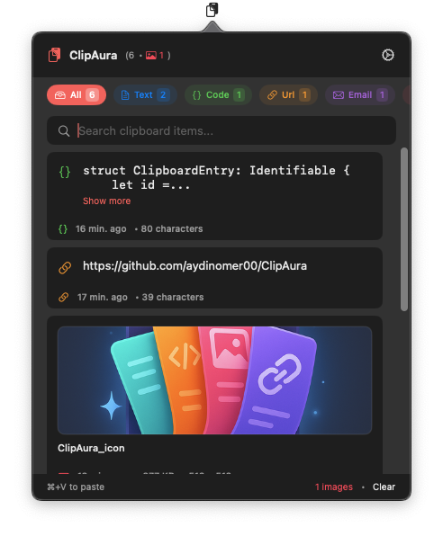
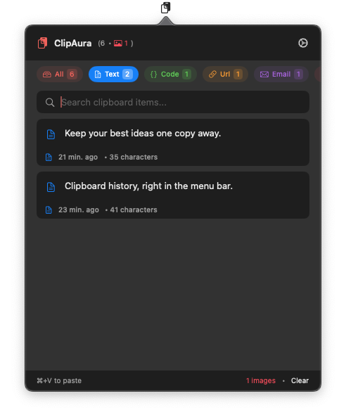
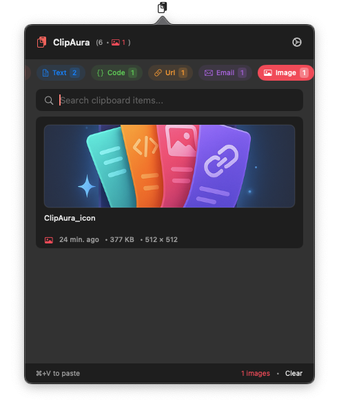
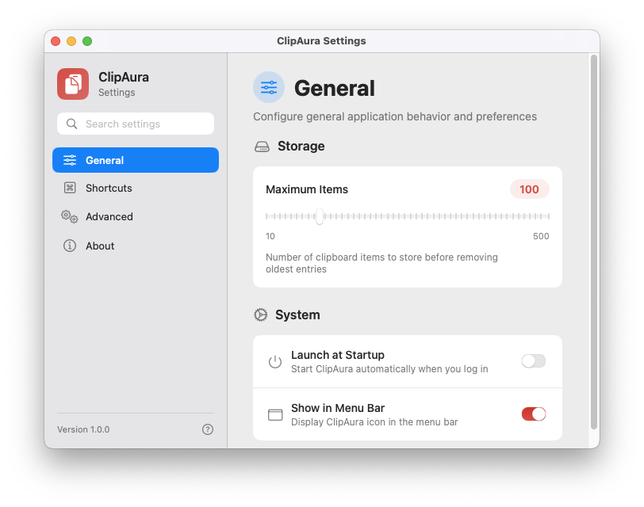
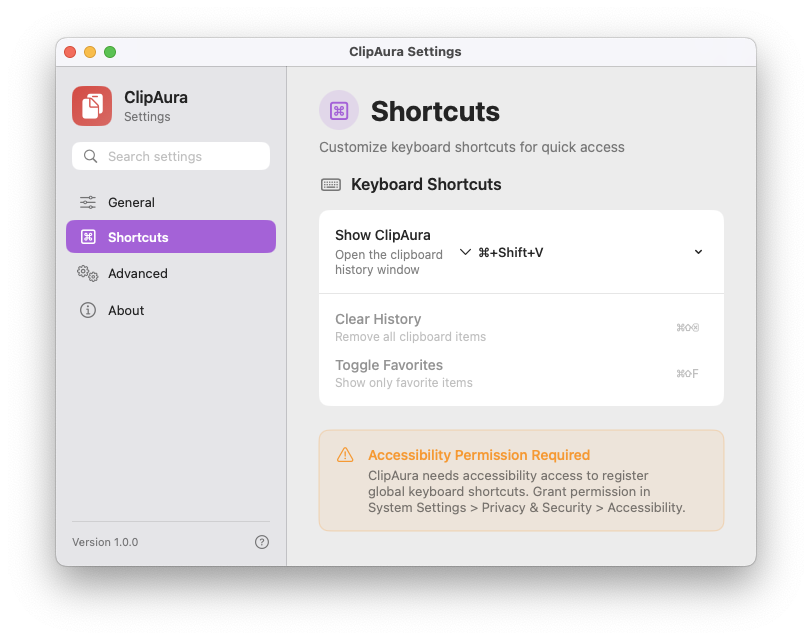

# ClipAura

**Your clipboard history, one click away.** ClipAura lives in the macOS menu bar and keeps recent text, code, links, email addresses, and images ready to copy again.

<p align="center">
  
</p>

<p align="center"><em>Recent copies, ready from the menu bar.</em></p>

## What it does

- Watches the system clipboard and keeps a searchable history across app launches.
- Groups text, code, URLs, email addresses, and images by detected content type.
- Opens from the menu bar or a selectable global shortcut (default: `⌘⇧V`).
- Copies a previous item back to the clipboard when you select it.
- Lets you set a history limit, clear the history, and enable launch at login.

## Screenshots

### Browse by type

Filter your history to find text or images without scrolling through everything.

| Text | Images |
|:---:|:---:|
|  |  |

### Make it yours

Set a history limit, enable launch at login, and choose a global shortcut.

<details>
<summary>Explore settings screenshots</summary>

| General | Shortcuts |
|:---:|:---:|
|  |  |

</details>

## Get started

**Requirements:** macOS 13 or later and Xcode to build from source.

```bash
git clone https://github.com/aydinomer00/ClipAura.git
cd ClipAura
open ClipAura.xcodeproj
```

Build and run the `ClipAura` scheme in Xcode. The clipboard icon appears in the menu bar. Copy something with `⌘C`, open ClipAura, then select a history item to copy it back. Use `⌘V` to paste it into your app.

For the global shortcut, allow ClipAura in **System Settings → Privacy & Security → Accessibility**. To start it automatically after login, turn on **Launch at Startup** in ClipAura's General settings. Use a stable installed app location when relying on launch at login.

## Privacy

Clipboard history is stored locally in the app's `UserDefaults`. It is **not encrypted by ClipAura**, and sensitive text copied to the clipboard may be saved. You can delete individual entries or clear the full history from the app.

## Built with

Swift, SwiftUI, AppKit, and XCTest.

## Author

Ömer Murat Aydın · [GitHub](https://github.com/aydinomer00) · [LinkedIn](https://linkedin.com/in/omermurataydin) · [Website](https://www.omermurataydin.com/)
